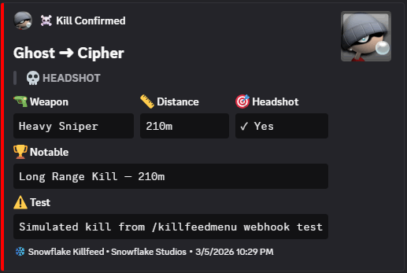

<div align="center">

# ❄️ Snowflake Killfeed Lite

### Free Edition — Open Source & Unencrypted

[](https://github.com/snowflake-studios/snowflake_killfeed_lite)
[](https://fivem.net/)
[](#)
[](#-license)

<br>

[](https://github.com/snowflake-studios/snowflake_killfeed_lite)

<br>

**A lightweight, event-driven killfeed notification system for FiveM.**
Zero loops. Zero idle overhead. Plug and play.

---

[Installation](#-installation) •
[Configuration](#%EF%B8%8F-configuration) •
[Lite vs Premium](#-lite-vs-premium-comparison) •
[Upgrade to Premium](#-upgrade-to-premium)

</div>

---

## ✨ What's Included (Free)

- **⚡ 0.00ms Idle** — Fully event-driven via `baseevents`. Zero resource consumption when nobody is dying.
- **🔧 Standalone Ready** — Works on **any** server. Auto-detects Qbox, QB-Core, and ESX for character names. Falls back to Steam/FiveM names if no framework is present.
- **🔓 Unencrypted & Open** — Full source code access for maximum customization.
- **🎮 Steam Persona Names** — Built-in SteamID64 conversion to fetch and cache authentic Steam names (requires API key).
- **🛡️ Safe & Stable** — XSS-safe text rendering, FiveM CEF-safe UI (no `backdrop-filter` crashes), and smart deduplication to prevent kill spam.
- **📤 Export API** — Trigger kill messages from your own resources (robberies, drug wars, etc.) with resource whitelisting.
- **🧪 Test Command** — `/killfeedtest` for instant in-game testing (ACE-protected).

---

## 🌟 Killfeed Premium Showcase

See the Premium version in action! Headshots, Steam avatars, actual weapon artwork, and advanced distance tracking:

[](https://youtu.be/JMhNe24ayE8)

---

## 🔥 Lite vs Premium Comparison

Killfeed Lite is a solid foundation — but if you want the features that make your server **stand out**, the Premium version is a different class entirely.

| Feature | Lite (Free) | Premium |
|:--------|:-----------:|:-------:|
| 0.00ms Event-Driven Architecture | ✅ | ✅ |
| Framework Auto-Detect (Qbox / QB-Core / ESX) | ✅ | ✅ |
| Steam Persona Name Support | ✅ | ✅ |
| Kill Deduplication | ✅ | ✅ |
| Export API for Custom Kill Messages | ✅ | ✅ |
| XSS-Safe Rendering | ✅ | ✅ |
| Configurable Colors & Layout | ✅ | ✅ |
| Test Command (`/killfeedtest`) | ✅ | ✅ |
| **Weapon Icon Images (104+ .webp + custom)** | ❌ Generic icon | ✅ Per-weapon art |
| **Headshot Detection** | ❌ | ✅ Early bone capture |
| **Kill Distance Tracking** | ❌ | ✅ Server-side authoritative |
| **Steam Profile Pictures in Feed** | ❌ | ✅ Killer + Victim avatars |
| **Discord Webhook Kill Logging** | ❌ | ✅ Rich embeds w/ thumbnails |
| **Discord Webhook Filters** | ❌ | ✅ Distance / Headshot / PvP |
| **In-Game Admin Settings Panel** (`/killfeedmenu`) | ❌ | ✅ Live color + layout editor |
| **Redzone / PVP Zone Support** | ❌ | ✅ Config, blockwars, exports |
| **Ped Kill Showcase Mode** | ❌ | ✅ Simulated names/avatars |
| **Persistent Theme System** (`theme.json`) | ❌ | ✅ Survives restarts |
| **Live Theme Sync to All Players** | ❌ | ✅ Instant broadcast |
| **Batched Steam Avatar Prefetch** | ❌ | ✅ 100 IDs/request |
| **Notable Kill Badges (Discord)** | ❌ | ✅ Long-range highlights |
| **Enriched Kill Pipeline** | ❌ | ✅ Reliable at all ranges |
| **Admin Commands** | 1 | 3 |
| **Tebex Escrow Protection** | N/A | ✅ Available |
| **Price** | Free | [From $14.99](https://snowflake-studios.tebex.io/) |

---

## 🚀 What You're Missing

### 🔫 104+ Weapon Icon Images + Custom Additions
The Premium killfeed renders **actual weapon artwork** inline — every weapon in GTA V has a hand-crafted `.webp` icon that appears in the kill notification. You can even drag-and-drop your own `.webp` icons for modded weapons. Lite shows the same generic crosshair SVG for every kill.

### 🛑 Redzone Arena Restrictions
Premium lets you restrict killfeed visibility ONLY to players who are actively standing inside designated PVP zones. Syncs effortlessly using hardcoded coordinates, external exports, or out-of-the-box native support for `sf_blockwars`. **Lite shows the killfeed globally to everyone.**

### 🎥 Ped Kill Showcase Mode
Perfect for creating promotional footage on solo test servers. Premium lets you simulate highly-realistic "player vs player" killfeed notifications when shooting standard NPC peds, utilizing randomized gamer-style names and rotating Xbox-style avatars. **Lite just says 'Ped'.**

### 🎯 Headshot Detection
Premium uses **early bone capture** (bone 31086 / SKEL_Head) during the `CEventNetworkEntityDamage` event — before ragdoll or LOD can clear the data — giving you reliable headshot detection even at extreme range. A red crosshair icon marks headshot kills in the feed. **Lite has no headshot detection.**

### 📏 Kill Distance Tracking
Every kill in Premium calculates distance **server-side** using authoritative `GetEntityCoords` — no client streaming inaccuracies. Kills above a configurable threshold (default 50m) display the distance right in the notification. **Lite does not track distance.**

### 👤 Steam Profile Pictures
Premium renders **circular Steam profile pictures** for both killer and victim in the killfeed — with color-coded borders (cyan for killer, magenta for victim) and matching glow effects. Avatars are batched-prefetched on startup (100 IDs per Steam API call) and cached per-player on join, so they're ready before the first kill. **Lite has no avatar support.**

### 📨 Discord Webhook Kill Logging
Every kill can be logged to Discord as a **rich embed** with weapon, distance, headshot status, Steam avatar thumbnails, and color-coded styling (red for headshots, cyan otherwise). Configure **AND-gated filters** to only log what matters: minimum distance, headshot-only, or PvP-only. Lite has **zero Discord integration**.



### 🎨 In-Game Admin Settings Panel
Type `/killfeedmenu` to open a full NUI settings panel — change killer/victim/theme/background colors with live color pickers, adjust vertical/horizontal position with sliders, tweak border radius, and preview changes in real-time. Saved to `theme.json` and synced to all connected players instantly. **Lite requires manual config.lua edits and a resource restart.**

### 🔁 Live Theme Sync
Change the theme once via the admin panel and every connected player sees the update **immediately** — no restart, no refresh. Theme persists across server restarts via `theme.json`.

---

## 🛒 Upgrade to Premium

<div align="center">

**Ready to give your players the killfeed they deserve?**

| Package | Price | What You Get |
|:--------|:-----:|:-------------|
| **Escrowed** | $14.99 | Full premium features, core code protected via Tebex escrow |
| **Open Source** | $34.99 | Full premium features + complete unencrypted source code |

### **[🛒 Browse Packages on Snowflake Studios](https://snowflake-studios.tebex.io/)**

[](https://discord.gg/mte6qwW98W)

</div>

---

## 📋 Requirements

| Dependency | Required | Notes |
|---|---|---|
| **[ox_lib](https://github.com/overextended/ox_lib)** | ✅ Yes | Core utility library |
| **[baseevents](https://github.com/citizenfx/fivem-data)** | ✅ Yes | Kill detection (included with FiveM) |
| **[qbx_core](https://github.com/Qbox-project/qbx_core)** | ❌ Optional | Auto-detected for character names |
| **[qb-core](https://github.com/qbcore-framework/qb-core)** | ❌ Optional | Auto-detected for character names |
| **[es_extended](https://github.com/esx-framework/esx_core)** | ❌ Optional | Auto-detected for character names |

---

## 🚀 Installation

1. Place `snowflake_killfeed_lite` in your server's `resources` directory.
2. Add to `server.cfg` (after dependencies):
   ```cfg
   ensure ox_lib
   ensure baseevents
   ensure snowflake_killfeed_lite
   ```
3. Add ACE permissions to `permissions.cfg`:
   ```cfg
   add_ace group.admin command.killfeedtest allow
   ```
4. Restart your server.

---

## ⚙️ Configuration

All settings are in `config.lua`.

### Colors & Layout
```lua
Config.Colors = {
    killer = '#00F0FC',      -- Killer name (Cyan)
    victim = '#FF1493',      -- Victim name (Magenta)
    weapon = '#FFFFFF',      -- Weapon text (White)
    background = '#0F0F14'   -- Card background
}

Config.Layout = {
    posX = 0.8,              -- Horizontal position (0.8vw from right)
    posY = 50,               -- Vertical position (50vh center)
    borderRadius = 0         -- Corner roundness (px)
}
```

> 💡 **Premium Tip:** The Premium version lets you change all of this in-game via `/killfeedmenu` with real-time preview — no config edits or restarts needed.

### Name Display Mode

**Character Names (Default):**
```lua
Config.NameMode = 'character'
```
Auto-pulls character names from Qbox, QB-Core, or ESX.

**Steam Persona Names:**
```lua
Config.NameMode = 'steam'
Config.SteamApiKey = 'YOUR_STEAM_WEB_API_KEY_HERE'
```
Get a key at [steamcommunity.com/dev/apikey](https://steamcommunity.com/dev/apikey).

> 💡 **Premium Tip:** The Premium version also displays **Steam profile pictures** alongside names in the killfeed when using Steam mode.

### Testing Mode
```lua
Config.EnablePedKillTest = false  -- Set true for dev/solo testing
```
When enabled, killing any NPC triggers a killfeed entry. Disable for production.

---

## 💻 Admin Commands

| Command | Usage | Description |
|:--------|:------|:------------|
| `/killfeedtest` | `/killfeedtest [1-7]` | Spawn test killfeed entries |

> 💡 **Premium adds:** `/killfeedmenu` (live settings panel) and `/killfeedreset` (reset theme to defaults).

---

## 🔧 Developer Exports

Trigger the killfeed from your own resources:

**1. Whitelist your resource in `config.lua`:**
```lua
Config.AllowedExportResources['my_robbery_script'] = true
```

**2. Call the export:**
```lua
-- With names:
exports.snowflake_killfeed_lite:AddKill('Officer John', 'Criminal Mike', 'Combat Pistol')

-- With server IDs (auto-resolves names):
exports.snowflake_killfeed_lite:AddKill(source, targetId, 'Knife')
```

> 💡 **Premium Tip:** The Premium export also accepts `isHeadshot` and `distance` parameters, auto-resolves Steam avatars for both players, and logs the kill to Discord.

---

## 📁 File Structure

```
snowflake_killfeed_lite/
├── fxmanifest.lua          -- Resource manifest
├── config.lua              -- All user-configurable settings
├── LICENSE.md
├── README.md
├── client/
│   └── main.lua            -- Kill detection, NUI bridge, ped kill test
├── server/
│   └── main.lua            -- Kill processing, name resolution, broadcasts
└── html/
    ├── index.html           -- NUI entry point
    ├── style.css            -- Killfeed card styles
    ├── script.js            -- NUI logic (vanilla JS)
    └── img/                 -- Assets (like webhook preview)
```

---

## 🆘 Support

- **Store:** [snowflake-studios.tebex.io](https://snowflake-studios.tebex.io/)
- **Discord:** [discord.gg/mte6qwW98W](https://discord.gg/mte6qwW98W)
- **Email:** support@snowflake-studios.xyz

---

## 📄 License

**Snowflake Killfeed Lite** is free to use and modify on your server. Re-selling or redistributing as a paid package is prohibited. See [LICENSE.md](LICENSE.md) for full terms.

---

<div align="center">

### Enjoying Killfeed Lite? You'll love the Premium.

**[🛒 Get Snowflake Killfeed Premium →](https://snowflake-studios.tebex.io/)**

---

**© 2026 Snowflake Studios — All Rights Reserved**

</div>

